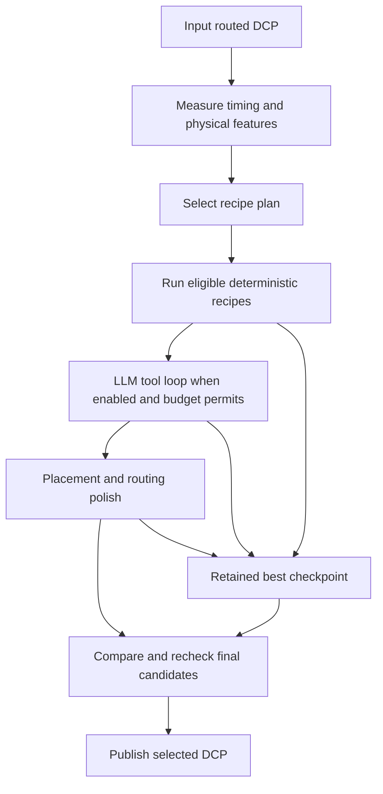

# RouteAgents: main implementations explained

Source: [Geochatz3/routeagents-fpl26](https://github.com/Geochatz3/routeagents-fpl26).

Reviewed on September 16, 2026, at public commit `4a929b490dad048198e746d15c475a8c19dc5017`. This guide explains the source implementation; it does not claim a reproduced FPGA result. No project tests or FPGA tools were run for this review.

## 1. What the system does

RouteAgents accepts a placed-and-routed FPGA design checkpoint (`.dcp`) and searches for a faster implementation under runtime and model-cost limits. Its output is another checkpoint with the best retained result.

Its main contribution is the coordination of three things:

1. A library of physical transformations and multi-step recipes.
2. Rules that select suitable recipes from measured design features.
3. Controllers that measure results, preserve good checkpoints, and limit further spending.

The LLM is one decision-making component within that system. The repository does not present model-weight training as its optimization method. Many transformations run deterministically before or after the model loop.

For clock period `T` and worst negative slack `WNS`, in nanoseconds:

```text
Achievable Fmax in MHz = 1000 / (T - WNS)
```

For example, a 2 ns clock with -1 ns slack gives approximately 333.3 MHz. Improving slack to -0.5 ns raises that estimate to 400 MHz without changing the clock constraint. The result must be measured in a valid physical state; an unrouted design can produce misleadingly optimistic timing.

## 2. Repository structure and execution flow

| Location | Main responsibility |
|---|---|
| `dcp_optimizer.py` | Main agent, run state, phase sequencing, and LLM completion orchestration |
| `optimizer/phase1_sense.py`, `static_parsers.py` | Collect and interpret design measurements |
| `optimizer/recipe_router.py`, `recipe_policy.py` | Select and restrict recipes using measured features |
| `optimizer/recipe_passes.py` | Implement deterministic chains and callable recipe macros |
| `optimizer/tool_dispatch.py`, `tool_source.py` | Expose and dispatch tools and macros |
| `optimizer/ils_polish.py`, `polish_ladder.py` | Explore alternative physical implementations after stagnation |
| `optimizer/deep_replace_sibling.py` | Explore independent replacements from the original input |
| `optimizer/tail_controller.py` | Select late-stage moves using measured gain per second |
| `optimizer/strategy_memory.py`, `negative_memory.py` | Retrieve prior successes and unsuccessful attempts |
| `optimizer/wall_economics.py`, `route_gate.py` | Decide whether additional work is worthwhile and feasible |
| `optimizer/finalization.py`, `finalize_mux.py` | Compare final candidates and publish the selected artifact |
| `scripts/multi_restart_optimize.py` | Run multiple attempts under a shared budget |
| `VivadoMCP/`, `RapidWrightMCP/` | Connect the agent to physical-design tools |
| `prompts/` | Instructions for model-guided strategy and operand selection |
| `validate_dcps.py` | Separate structural and simulation-based validation harness |

The conceptual flow is:



Individual stages can be skipped by configuration, missing evidence, or budget gates. This diagram is an architectural overview, not an unconditional sequence of every possible command.

Source: [main agent](https://github.com/Geochatz3/routeagents-fpl26/blob/4a929b490dad048198e746d15c475a8c19dc5017/dcp_optimizer.py), [optimizer modules](https://github.com/Geochatz3/routeagents-fpl26/tree/4a929b490dad048198e746d15c475a8c19dc5017/optimizer).

## 3. Feature-based recipe selection

`PhaseOneFeatures` stores observations such as slack, clock period, failing-endpoint count, average critical-path spread, cell count, utilization, route-delay fraction, and remaining runtime. `decide_recipe_path()` returns a `RecipePlan`: ordered actions, blocked actions, and an explanation of the selection.

The router distinguishes physical situations rather than using benchmark names as decision keys:

- A very large failing population can justify broad retiming or a route-first operation.
- A spread-out design with substantial timing failure may receive a placement-preserving sweep or a full replacement, depending on the other features and cost.
- A nearly closed design may receive focused endpoint optimization rather than a disruptive global replacement.
- Missing or out-of-range evidence leads to restricted fallback behavior.

The source computes failing slack depth as `max(0, -WNS)`. This matters: positive slack must not be mistaken for a deeply failing design simply because its absolute value is large.

**Why it helps:** it reduces wasted experiments and gives the model an ordered plan with explicit exclusions. The thresholds are empirical policy choices and should be recalibrated before transferring them to another environment.

Source: [recipe_router.py](https://github.com/Geochatz3/routeagents-fpl26/blob/4a929b490dad048198e746d15c475a8c19dc5017/optimizer/recipe_router.py).

## 4. The physical optimization recipes

The documented 42 plays include related directive variants, recipe chains, and controller stages. They should not be interpreted as 42 unrelated optimization algorithms.

### Granular physical optimization

`_recipe_post_route_phys_opt_sweep()` runs individual Vivado sub-optimizations rather than one opaque broad directive. It measures each subpass, retains gains, and reopens the retained checkpoint after regressions. Bounds can stop the sweep after its first useful gain or when too little time remains.

**Purpose:** isolate which sub-operation helps and avoid paying for a full global flow on every attempt.

### Scoped critical-path optimization

`_recipe_critical_path_focused_phys_opt()` selects a bounded group of critical paths, creates a path group, and applies a chosen physical optimization to that scope.

**Purpose:** focus effort on the endpoints limiting timing. A tiny scope is unlikely to solve a design with an enormous failing population, so the router can block it.

### High-fanout replication

`_recipe_high_fanout_timing_replication()` targets named high-fanout nets involved in critical timing. Replicating a driver can reduce load or shorten the routes to its sinks.

**Purpose:** address a specific electrical and physical bottleneck. Replication can also increase congestion, so the resulting timing and routing must be checked.

### Cell relocation and LUT-cone optimization

The cell-replacement macro searches for movable cells associated with excessive route detours. The LUT macro extracts critical-path input pins, invokes RapidWright cone optimization, writes the modified checkpoint, reopens it in Vivado, reroutes, and measures again.

**Purpose:** improve operand placement or reduce combinational depth. The LUT macro is a logical-netlist transformation, so physical timing checks alone do not establish functional equivalence.

### Register retiming

`_recipe_register_retiming()` invokes a retiming-capable physical optimization, reroutes affected connectivity, checks routing errors, and obtains a fresh timing report.

**Purpose:** redistribute logic across register boundaries to reduce the longest stage delay. This has stronger correctness requirements than simply changing placement. A successful recipe status or a similar flip-flop count is not a formal sequential-equivalence proof.

Source for these macros: [recipe_passes.py](https://github.com/Geochatz3/routeagents-fpl26/blob/4a929b490dad048198e746d15c475a8c19dc5017/optimizer/recipe_passes.py).

## 5. Escaping a plateau: partial replacement and independent alternatives

`ils_polish.py` implements iterated local search: perturb the current physical implementation, rebuild it, compare the outcome with the retained best, and restore the retained state after a rejected result.

Its moves include full replacement, routing-only changes, incremental routing escalation, and partial replacement. `partial_ruin_tcl()` gathers fabric cells associated with critical paths and unplaces that subset. The default scope is 200 paths, not 200 cells. Its cell filter includes several fabric primitive groups, including registers, LUTs, carry and mux resources.

Partial replacement is skipped when critical-path spread is unavailable or below 30 tiles. The rationale is that a compact path has less obvious placement dispersion to repair. One concluding sentence in the upstream playbook reverses this condition; the implementation and lead table agree on the skip rule.

Separately, `deep_replace_sibling.py` starts independent alternatives from the original input checkpoint. This avoids making every candidate inherit the choices of the current local optimum.

**Why it helps:** a good implementation can survive while alternative placements are explored. A failed alternative costs time, rather than requiring the system to surrender its earlier gain.

Sources: [ils_polish.py](https://github.com/Geochatz3/routeagents-fpl26/blob/4a929b490dad048198e746d15c475a8c19dc5017/optimizer/ils_polish.py), [deep_replace_sibling.py](https://github.com/Geochatz3/routeagents-fpl26/blob/4a929b490dad048198e746d15c475a8c19dc5017/optimizer/deep_replace_sibling.py).

## 6. What the LLM actually contributes

The model receives measured evidence, the router's plan, prior-run hints, and results from its recent tool calls. It can choose recipes and parameters, inspect fresh timing reports, and identify specific cells, nets, or endpoints to target.

This is a broader role than choosing a label such as `PBLOCK` from a fixed menu. The system also permits low-level tool calls and Tcl, with dispatch checks around them. The runtime manages conversation size, API errors, request timeouts, and a cost ledger. If model access fails, the controller can still finalize a retained result.

**Why it helps:** the model can interpret detailed reports and choose operands that fixed global directives cannot specify automatically. Its recommendation is still only a proposal; physical measurements determine whether it helped.

Sources: [tool_dispatch.py](https://github.com/Geochatz3/routeagents-fpl26/blob/4a929b490dad048198e746d15c475a8c19dc5017/optimizer/tool_dispatch.py), [llm_runtime.py](https://github.com/Geochatz3/routeagents-fpl26/blob/4a929b490dad048198e746d15c475a8c19dc5017/optimizer/llm_runtime.py).

## 7. Learning from previous attempts

`strategy_memory.py` stores run records in JSONL and retrieves relevant experience using a physical fingerprint. Its nearest-record distance is:

```text
distance = abs(current_LUT_count - prior_LUT_count) / 10000
         + abs(current_spread - prior_spread) / 50
```

The selected record supplies useful tool sequences and hints. Negative records provide advice about regressions or wasted budget; those warnings do not themselves prohibit a tool call.

This is retrieval of optimization experience, not model-weight training. A limitation is that `winning_tools_from_call_details()` associates improvements with the most recent transformative call. That is useful bookkeeping, but cannot prove that this one call caused a gain produced by an entire chain.

Within a run, `tail_controller.py` also learns from recent moves. It compares gain per second, retires unproductive moves, and makes other moves eligible again after an accepted change. This captures the fact that an operation which was useless before a placement change may become useful afterward.

Sources: [strategy_memory.py](https://github.com/Geochatz3/routeagents-fpl26/blob/4a929b490dad048198e746d15c475a8c19dc5017/optimizer/strategy_memory.py), [tail_controller.py](https://github.com/Geochatz3/routeagents-fpl26/blob/4a929b490dad048198e746d15c475a8c19dc5017/optimizer/tail_controller.py).

## 8. Runtime economics and early stopping

The contest objective penalizes both elapsed time and model spending:

```text
score = gain_MHz * (1 - 0.1 * (LLM_cost_USD + runtime_hours))
```

`wall_economics.py` estimates whether observed progress justifies further runtime. Its marginal hurdle for a proposed time horizon is approximately:

```text
required_gain_MHz = banked_gain_MHz * 0.1 * horizon_hours / penalty_factor
```

This is the implementation's marginal estimate, not an exact finite-step break-even equation. Missing progress history keeps exploration eligible rather than manufacturing evidence for an economic stop.

Other gates estimate whether routing or another restart fits the remaining budget. `logic_floor.py` supplies a separate early-stop heuristic based on path composition and optimistic delay assumptions, with repeated timing measurements before accepting its conclusion. Its calibrated delay assumptions are not a universal physical lower-bound proof.

**Why it helps:** the controller can stop when additional work is unlikely to improve the final score, even if more wall time is technically available. Conversely, merely reaching zero WNS does not exhaust the achievable-frequency objective.

Sources: [wall_economics.py](https://github.com/Geochatz3/routeagents-fpl26/blob/4a929b490dad048198e746d15c475a8c19dc5017/optimizer/wall_economics.py), [route_gate.py](https://github.com/Geochatz3/routeagents-fpl26/blob/4a929b490dad048198e746d15c475a8c19dc5017/optimizer/route_gate.py), [logic_floor.py](https://github.com/Geochatz3/routeagents-fpl26/blob/4a929b490dad048198e746d15c475a8c19dc5017/optimizer/logic_floor.py).

## 9. Keeping and publishing the best result

The agent distinguishes experimental state from retained checkpoints. Final-candidate registration allows speculative recipes to compete with the main pipeline result. Finalization compares candidates, applies the relevant checks, and publishes a selected output. The restart wrapper preserves winners across attempts and includes emergency-finalization handling.

The public helpers record output size and MD5 and normally copy through a temporary file followed by replacement. One implementation detail matters: `_atomic_copy()` falls back to a direct copy on failure, so its fallback does not provide the normal path's atomic-replacement guarantee.

Constraint protection has two components: filtering suspicious Tcl commands and comparing timing-constraint fingerprints. If fingerprint capture is unavailable, the guard reports integrity as `UNVERIFIED` and continues. That is an explicit limitation, not affirmative evidence of unchanged constraints.

The separate validator performs structural checks and simulation. Those checks provide evidence of matching behavior under their coverage, but should not be described as exhaustive formal equivalence, especially for retiming.

Sources: [finalization.py](https://github.com/Geochatz3/routeagents-fpl26/blob/4a929b490dad048198e746d15c475a8c19dc5017/optimizer/finalization.py), [finalize_mux.py](https://github.com/Geochatz3/routeagents-fpl26/blob/4a929b490dad048198e746d15c475a8c19dc5017/optimizer/finalize_mux.py), [constraint_guard.py](https://github.com/Geochatz3/routeagents-fpl26/blob/4a929b490dad048198e746d15c475a8c19dc5017/optimizer/constraint_guard.py), [validator](https://github.com/Geochatz3/routeagents-fpl26/blob/4a929b490dad048198e746d15c475a8c19dc5017/validate_dcps.py).

## 10. What this suggests for our optimizer

| RouteAgents mechanism | Practical lesson for our implementation |
|---|---|
| Feature-selected deterministic recipes | Establish useful first moves before spending model calls |
| Scoped operations and partial replacement | Expand beyond global placement and routing directives |
| Independent alternatives plus retained checkpoints | Explore without confusing a speculative result with the deliverable |
| Persistent positive and negative outcomes | Learn which complete recipes earn their runtime cost |
| State-dependent action retirement | Reconsider an operation after relevant physical changes |
| Economic stopping | Separate selecting the best artifact from deciding whether to keep searching |

These mechanisms informed our five upgrades. Their implementation is documented separately in [our adaptive-optimizer guide](adaptive-optimizer-upgrades.md). Their effectiveness in our environment still requires matched experiments; the [09-17 log analysis](../../results/Analysis%20-%2009_17.md) identifies older execution behavior rather than evidence of the new controller running.

## 11. Public source versus contest submission

The repository describes its result as **top five**, not verified first place. It reports a seven-design total score of 369.9. Its archived scored commit is `d8ae7bd8f1f8e4f434d21c751fd853f73be7ed96`, tagged `fpl26-final-submission`.

The reviewed public main branch includes later changes and omits the measured seed-memory file present in the submission. Consequently, running the public checkout is not a byte-identical replay of the evaluated system. Its reported seven-design total also cannot be directly compared with our twelve-design average score.

Source: [provenance and disclosed differences](https://github.com/Geochatz3/routeagents-fpl26/blob/4a929b490dad048198e746d15c475a8c19dc5017/docs/PROVENANCE.md).
